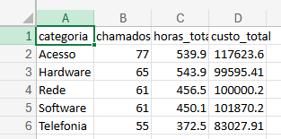

# Consolidador de Relatórios de Chamados

Automação em Python que lê relatórios mensais de chamados exportados por quatro
sistemas diferentes, trata as inconsistências entre eles e gera um único arquivo
Excel com os dados limpos e três resumos gerenciais.

O que era feito manualmente em algumas horas por mês passa a levar segundos.



---

## O problema

Quatro sistemas exportam o mesmo tipo de relatório de formas diferentes: nomes de
coluna divergentes, formatos de data distintos, separadores diferentes, além de
erros de digitação e registros duplicados.

Consolidar isso na mão é lento e sujeito a erro — e o erro é silencioso: uma
categoria escrita de três formas vira três linhas no relatório final, e ninguém
percebe.

**Entrada:** 4 arquivos CSV, 330 registros brutos
**Saída:** 1 arquivo `.xlsx` com 4 abas, 319 chamados tratados

---

## O que cada arquivo de entrada tinha de errado

Levantado antes de qualquer correção, aplicando um protocolo de diagnóstico de
7 verificações em cada arquivo.

| Arquivo | Defeitos encontrados |
|---|---|
| `chamados_2026_05.csv` | Nenhum — usado como referência de formato |
| `chamados_2026_06.csv` | Nomes de coluna divergentes; datas em dia/mês/ano |
| `chamados_2026_07.csv` | Separador `;`; vírgula decimal (colunas numéricas lidas como texto); valores ausentes em 3 colunas; **11 linhas duplicadas**; nomes divergentes; datas em dia/mês/ano |
| `chamados_2026_08.csv` | Espaços nos nomes das colunas e dentro dos valores; categoria escrita em 3 capitalizações; horas negativas; custos inflados por erro de digitação; datas em dia/mês/ano |

---

## Decisões de tratamento

As correções mecânicas não estão listadas aqui. Estas são as que exigiram
julgamento — e o motivo de cada uma:

**Data de fechamento vazia → não preenchida.** O vazio não é falha de registro:
significa que o chamado ainda está em aberto. Preencher destruiria a informação.
Criada a coluna `status` para tornar esse estado explícito. São 5 chamados.

**Técnico não informado → "Não atribuído", nunca a moda.** A moda dessa coluna é
o nome de uma pessoa real. Preencher com ela registraria que alguém executou um
atendimento que não fez — o que distorceria qualquer medição de produtividade.

**Horas negativas → valor absoluto.** Antes de decidir, examinei as 3 linhas: o
restante dos campos estava íntegro e as magnitudes (10,4h / 7,6h / 2,4h) caem na
faixa normal dos demais chamados. O erro é o sinal, não o valor — substituir pela
mediana descartaria informação correta.

**Custos absurdos → divididos por 1000.** Três chamados registravam entre
R$ 419.960 e R$ 3.132.690, contra uma faixa legítima de R$ 83 a R$ 3.181.
Divididos por 1000, os três caem dentro da faixa normal *e* resultam em valores
com exatamente duas casas decimais, como todos os outros custos. Isso indica erro
sistemático de digitação, não valor inválido.
*Limitação: o corte é fixo em R$ 10.000 e precisa ser revisto se a operação
passar a ter chamados legitimamente caros.*

**Custo não informado → mediana.** Um único registro. Escolhida a mediana em vez
da média porque a coluna continha outliers que puxariam a média para cima.

---

## O que o relatório revelou

O tempo médio de resolução é praticamente idêntico entre todas as prioridades:
chamados classificados como "Crítica" levam 2,51 dias corridos, contra
2,57 dias dos classificados como "Baixa" — uma diferença de 0,06 dia sobre
319 chamados.

Espera-se que a prioridade determine a ordem de atendimento. Os dados mostram
que ela não está afetando o tempo de resposta, o que sugere atendimento por
ordem de chegada. Na prática, um incidente realmente crítico esperaria o mesmo que um chamado
trivial.

---

## Como rodar

```bash
pip install pandas openpyxl
jupyter notebook consolidador_relatorios.ipynb
```

Executar todas as células (`Kernel → Restart Kernel and Run All Cells`).
O arquivo `relatorio_consolidado.xlsx` é gerado na raiz do projeto.

---

## Estrutura

```
projeto-relatorios/
├── dados/
│   ├── chamados_2026_05.csv
│   ├── chamados_2026_06.csv
│   ├── chamados_2026_07.csv
│   └── chamados_2026_08.csv
├── consolidador_relatorios.ipynb
├── relatorio_consolidado.xlsx
└── README.md
```

---

## Tecnologias

- **Python 3**
- **pandas** — leitura, tratamento, agregação
- **openpyxl** — escrita do arquivo Excel com múltiplas abas
- **Jupyter Notebook**

---

## Sobre

Projeto desenvolvido por Pedro Henrique Lundgren, estudante de Engenharia da
Computação na PUCPR, como prática de tratamento de dados e automação de
relatórios com Python e pandas.
